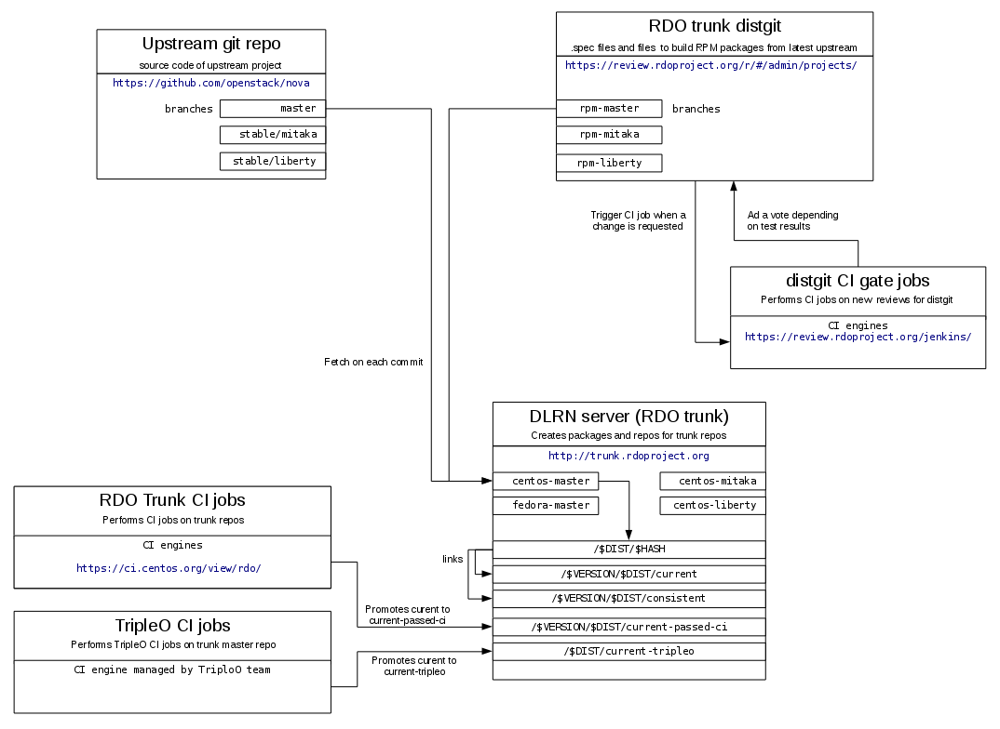

Time goes fast as a RDO newbie and once I understood what the RDO Trunk and CloudSIG repos provide (read my [previous post](https://www.rdoproject.org/blog/2016/05/new-in-rdo-repos-one-size-doesn-t-fit-all/) if you still have doubts), my next goal was to have a clear high-level perspective of the entire delivery workflow followed in the project.

Although there is a lot of detailed and great information in different sources (see [More info](####More info) at the end of the post), it may be useful for others to provide a high level and global description of it. In this post I'll focus in the process around RDO Trunk repositories as shown in the following diagram:

## Code repositories

### Upstream Code

As for any packaging project, everything starts with the upstream code. For RDO, it is provided by OpenStack projects in https://github.com/openstack/&lt;project> . The process to manage these repos is defined by OpenStack and can be found in their [Developer Guide](http://docs.openstack.org/infra/manual/developers.html) and the [Release Process](http://docs.openstack.org/project-team-guide/release-management.html).

In RDO, these repositories are used to fetch the code that will be packaged for both RDO Trunk and CloudSIG in different ways:

- For RDO Trunk, the automatic packager, DLRN clones the involved git repo.
- For RDO CloudSIG, the specific tarball for the point release to be packaged will be fetched at packaging time.

### Distgit repo

As described in the great [RDO packaging guide](https://www.rdoproject.org/packaging/rdo-packaging.html), ditgit is the git repository "where the .spec file lives" . For RDO, distgit repos are located in https://review.rdoproject.org/r/#/admin/projects/openstack/&lt;project>-distgit (you can see the entire list [here](https://review.rdoproject.org/r/#/admin/projects/?filter=distgit)). Typically they contain the spec files used to build RPM packages, systemd unit files and some system config files (i.e. logrotate or sudoers configuration).

Because of the reproducibility requirements of RDO CloudSIG packaging, spec files for these and trunk repos differ slightly:

- Changelog, version and release fields for the trunk is automatically generated while it must be manually created for stable packages.
- The source code is fetched from a versioned tarball for stable.

Also, we usually have different requirements for each OpenStack version so different branches are created based on version and RDO "flavor" (trunk or CloudSIG):

- rpm-&lt;version> : is used to package RDO trunk (version can be master, mitaka or liberty )
- &lt;version>-rdo : is used for RDO CloudSIG (as this is only for released version, master-rdo does not exist)

To ensure proper management of distgit repos, required changes follow a review process in [RDO rpmfactory](https://review.rdoproject.org/r/) quite similar to the OpenStack project. Before merging the change in the actual repository, every request (review) will trigger a test job in the [CI system](https://review.rdoproject.org/jenkins/) that will post its -/+1 vote depending on the results and will require a core contributor to review and validate it.

## DLRN: automatic packager for RDO Trunk

Packaging for RDO trunk is done by [DLRN](https://github.com/openstack-packages/DLRN), a tool to build RPM packages on each commit merged in a set of configurable repositories. DLRN uses rdopkg to retrieve the metadata and repositories associated with each package (code and distgit) and mock to carry out the actual build.

NVR for packages generated by DLRN follows some rules:

- **Version** is set to MAJOR.MINOR.PATCH of the *next* upstream version.
- **Release** is 0.&lt;timestamp>.&lt;short commit hash>

For example, python-novaclient-3.4.1-0.20160412103538.77f214b.el7.centos.noarch.rpm is a package containing code released after GA of 3.4.0 and before 3.4.1 containing code until upstream commit [77f214b](https://github.com/openstack/python-novaclient/commit/77f214bdbd7d9e8ba935ace1dce0290061ddd737).

Once the package has been successfully built, DLRN creates a yum repository containing the latest version of every package successfully built at that time. This repo will not change and is created in a unique directory based on the specific commit hash. These repos will be available if a user wants to test an installation based on a specific commit. Finally, DLRN manages two "shorcuts" for repositories:

- **current**: will point to the last created per-commit repo.
- **consistent**: current repo, may not contain the latest versions of packages that failed to build (i.e. let's assume that packaging of python-nova package failed while a later build of python-cinder succeed, in this case, current would contain the latest upstream version of cinder but not for nova). To avoid this situation, a new pointer "consistent" is managed by DLRN and will point to the last snapshot that contained package versions in sync with upstream versions.

Also, DLRN creates some html reports that can be used to check the results of each single build and provides the logs for troubleshooting any error while building the package.

## Continuous Integration in RDO Trunk

To ensure the packages built by DLRN work as expected, the RDO project manages some CI jobs pipeline in the [CentOS CI](https://ci.centos.org/view/rdo/) system. These jobs are created using jenkins-job-builder with the configuration managed in [rdo-infra github](https://github.com/rdo-infra/ci-config). These jobs deploy and test RDO in different scenarios (packstack, tripleo quickstart and puppet) based mostly on WeIRDO (take a look into [weirdo documentation](http://weirdo.readthedocs.org/en/latest/how.html)) using the **consistent** repository. If all tests in the pipeline success, the content of the tested repo will be promoted as **current-passed-ci**. In this way, this link always points to the latest consistent repo that passed the CI jobs.

Additionally, **current-tripleo** repo is managed by a set of jobs focused on testing TripleO installer on the current-passed-ci repo. When those tests pass, this repo is promoted by this CI pipeline.

## Access to repositories

All the repositories and content managed by DLRN and CI jobs are directly accesible for public usage from DLRN server in [https://trunk.rdoproject.org/](https://trunk.rdoproject.org/). This includes:

- **consistent** repos from http://trunk.rdoproject.org/centos7-&lt;release>/consistent/
- **current-passed-ci** repos from http://trunk.rdoproject.org/centos7-&lt;release>/current-passed-ci/
- **current-tripleo** repos from http://trunk.rdoproject.org/centos7-master/current-tripleo/
- By-commit repos http://trunk.rdoproject.org/centos7-&lt;release>/AB/CD/ABCD...Z (where AB are the two first characters of the commit hash, CD the following two and ABCD...Z the entire hash). On each hash repository directory a delorean.repo file is created containing the yum configuration required to enable it easily.
- html formated build reports and build logs to help packagers to troubleshoot issues that may arise.

#### More info

[RDO Packaging guide](https://www.rdoproject.org/documentation/rdo-packaging/)  
[Delorean: OpenStack packages from the future by Frederic Lepied](http://blogs.rdoproject.org/7834/delorean-openstack-packages-from-the-future)  
[DLRN documentation]( https://github.com/openstack-packages/DLRN/tree/master/doc/source )  
[Testing Openstack is Hard by David Moreau Simard](http://redhat.slides.com/dmoreaus/testing-openstack-is-hard#/)  
