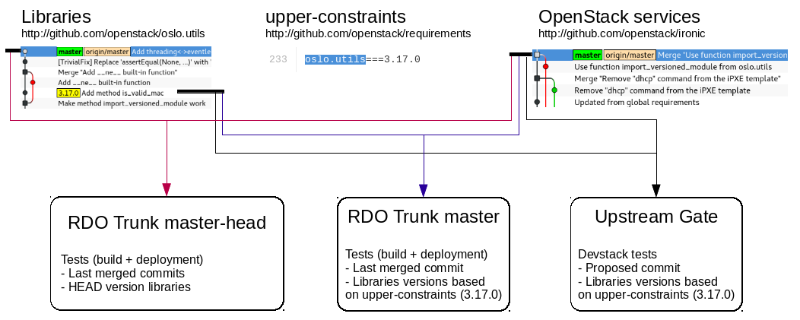

As explained in [a previous post](https://www.rdoproject.org/blog/2016/05/new-in-rdo-repos-one-size-doesn-t-fit-all/),
in RDO Trunk repositories we try to provide packages for new commits in OpenStack
projects as soon as possible after they are merged upstream. This has a number of advantages:

- It allows packagers to identify packaging issues just after introduced.
- For project developers, their changes are tested in non-devstack environments,
so test coverage is extended.
- For deployment tools projects, they can use these repos to identify problems
with new versions of packages and to start integrating any enhancement added to
projects as soon as it's merged.
- For operators, they can use these packages as hot-fixes to install in their RDO
clouds before patches are included in official packages.

This means that, for every merged commit a new package is created and a yum repository
is published in [RDO trunk server](http://trunk.rdoproject.org). This repo includes
the just built package and the latest builds for the rest of packages in the same
release.

Initially, we applied this approach to every package included in RDO. However,
while testing these repos during the Newton cycle we observed that jobs failed
with errors that didn't affect OpenStack upstream gates. The reason behind this
is that commits in OpenStack gate jobs are tested with versions of libraries
and clients defined in upper-constraints.txt files in [requirements project](https://github.com/openstack/requirements/blob/master/upper-constraints.txt)
for the branch where the change is proposed. Typically these are the last tag-released
versions. As RDO was testing using libraries from last commit instead of last
release, we were effectively ahead of upstream tests, running too fast.

While this provided some interesting information and we could identify issues very
early, it made very difficult to get stable repositories that could be promoted and
used. After some discussions in [RDO weekly meeting](https://meetbot.fedoraproject.org/rdo/2016-06-29/rdo_meeting_%282016-06-29%29.2016-06-29-15.00.log.html), it was decided to apply some changes
in the way libraries are managed to leverage the work done in upstream gates
but try to keep catching issues as soon as possible:

- For master branch, it was decided to pin libraries and clients to the versions
included in upper-constraints for repositories served in [http://trunk.rdoproject.org/centos7](http://trunk.rdoproject.org/centos7).
This repositories are used by RDO CI promotion jobs and marked as current-passed-ci when
all tests succeed.
- Additionally, a new builder was created that chases master in all packages,
including libraries, clients, etc... This builder is able to catch issues based
on unit tests executed when packages are created. The produced repos are available in
[http://trunk.rdoproject.org/centos7-master-head](http://trunk.rdoproject.org/centos7-master-head)
but promotion jobs are not executed using them.

The differences between master and master-head are shown in following diagram:

- For releases in maintenance phase we pin libraries to what's found in
upper-constraints.txt file in the corresponding branch.

## Implementation

In order to manage the libraries versions properly, RDO is using a peer-reviewed
workflow of gerrit reviews proposed to the rdoinfo project in
[http://review.rdoproject.org](http://review.rdoproject.org).
You can see an example [here](https://review.rdoproject.org/r/#/c/3698/2/rdo.yml).

A job is executed periodically that automatically creates gerrit reviews when
versions are updated in upper-constraints files. Manual approval is needed to
get the changes merged and the new versions built by DLRN builders.
